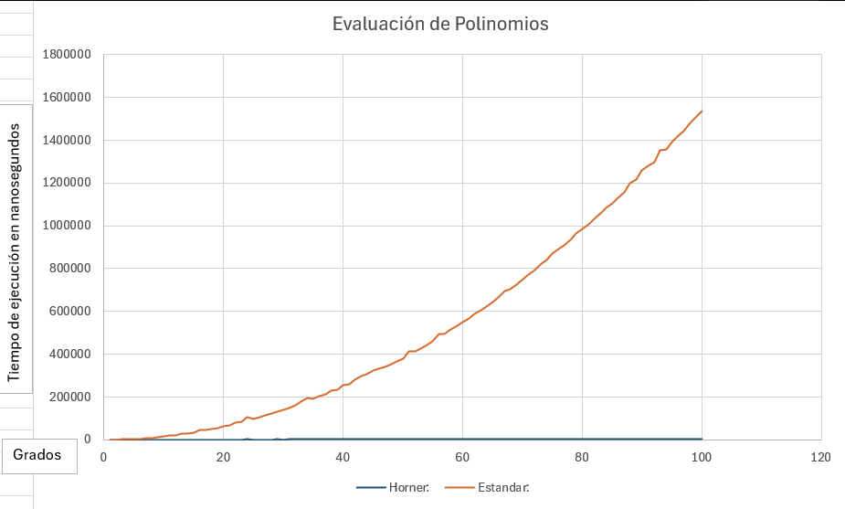

# comparacion-evaluacion-de-polinomios

# Evaluación de Polinomios 👮🏻‍♀️

### Resumen 

Un breve programa que ejecuta dos métodos diferentes para evaluar polinomios y que compara las evaluaciones de los dos métodos para observar su respectiva eficiencia. Esto por medio de evaluar dichos polinomios en valores que tienen un rango de -10 a 10 al igual que sus coeficientes. Se toma también el tiempo de evaluación usando un cronómetro para después calcular sus promedios en una última fila. 

Métodos utilizados:
1. Método de Horner
2. Método Estándar

### Requisitos

Se necesita tener un compilador c++ 20 y las bibliotecas/librerías usadas ya están dentro del programa las cuales corren en Windows, Linux, etc por igual. El programa fue creado y corrido en Windows 11. 
- **GCC** (GNU Compiler Collection)

### Instrucciones de compilación y ejecución

**Desde la terminal:**
1. Clone el repositorio:
   ```sh
   git clone https://github.com/vacota/comparacion-evaluacion-de-polinomios
   ```
2. Entre al directorio del proyecto:
   ```sh
   cd comparacion-evaluacion-de-polinomios
   ```
3. Compile el código:
   ```sh
   g++ main.cpp -o main -std=c++20
   ```
4. Ejecute el código
   ```sh
   ./main
   ```
### Descripción

El método estándar de evaluación de polinomios es básicamente la versión más intuitiva a la cual llegaría cualquier programador. Se trata de calcular de forma separada cada evaluación y al obtener este resultado sumarlo a una suma total acumulativa empezando desde el coeficiente más pequeño en el polinomio o sea el término constante. Por el otro lado, el otro método que es el método de Horner lo que hace es factorizar las x de un polinomio hasta obtener la versión más reducida de este y consecutivamente calcular el resultado por medio de sumas y multiplicaciones una encima de la otra o anidadas. Esto acorta la cantidad de operaciones que se hacen al igual que su magnitud ya que al aprovecharse de la factorización, las operaciones realizadas son muchísimo más pequeñas que las que se realizan en el método estándar.

### Resultados y gráfica



### Análisis de resultados

El método más rápido por mucho fue el método de Horner como se puede ver en la gráfica de arriba. La razón radica en lo antes mencionado que es el hecho que al hacerse muchas menos operaciones en el método de Horner a comparación del método estándar, el tiempo que se tarda en ejecutarse el algoritmo y realizar todos los cálculos en el rango dado es mucho menos. La diferencia del tiempo en relación con la complejidad teórica o su número de operaciones es tal que la complejdad de tiempo de el método estándar al no solo tener forma de media parábola también se comporta como una, o sea de forma cuadrática O(n^2). Esto significa que su complejidad no es tan mala pero tampoco es tan óptima como lo es el método de Horner. El método de Horner al analizarlo tiene una complejidad de tiempo lineal, o sea O(n), y al verlo en la gráfica hasta pareciera que tiene complejidad de O(1) lo cual en muchos casos es lo mejor que puede suceder ya que el tiempo de ejecución y utilización de recursos es mínimo.

### Conclusiones

En conclusión, pudimos observar tanto como por ejecutar el código en un compilador al igual que en la gráfica resultante que el método triunfante es sin dudas el método de Horner. Toma mucho menos tiempo que el método estándar por razones ya explicadas y es en general la mejor alternativa al querer realizar la menor cantidad de operaciones en la menor cantidad de tiempo al evaluar polinomios. Si lo imaginamos en el infinito, el método de Horner definitivamente reina supremo al método estándar el cual aunque ser intuitivo no es bueno ni para el usuario ni para la computadora. 

### Creador 🐐 
Denzel Omar Rivera Urias
